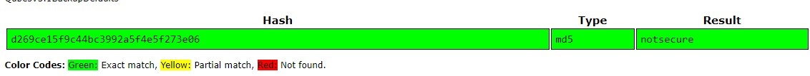

# flawed

Category: Cryptography

Points: 10

Description:

> Our l33t hackers hacked a bulletin board and gained access to the database. > We need to find the admin password.
>
> The user's database info is:
>
> Username:admin
>
> Passwordhash:d269ce15f9c44bc3992a5f4e5f273e06
>
> The flag is the plaintext password
>
> This flag is not in the usual format, you can enter it with or without the brixelCTF{flag} format

## Solution

It's just simple MD5 decryption

the flag is `brixelCTF{notsecure}`