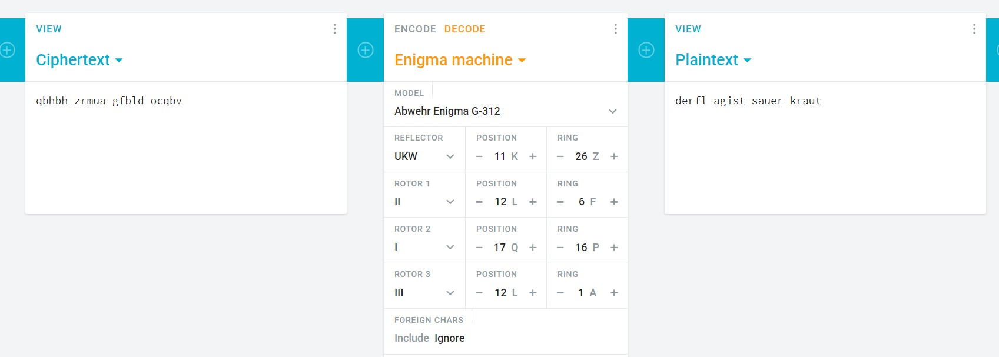

# Scheiße

Category: Cryptography

Points: 10

Description:

> A german messenger was caught during WW2
>
> He was carrying a piece of paper that read: qbhbh zrmua gfbld ocqbv
>
> He was nice enough to give us all we wanted, except the decoded message, he needs a special machine for that, and we don't have it.
>
> He DID give us the settings for the machine.
>
> The settings for this machine are:
>
> Model: G-312
>
> Reflector: UKW 11/26
>
> Rotor 1: 2/12/6
>
> Rotor 2: 1/17/16
>
> Rotor 3: 3/12/1
>
> The flag is ONE word, no spaces. do NOT translate the flag!
>
> This flag is not in the usual format, you can enter it with or without the brixelCTF{flag} format

## Solution

Did some search about german cryptography and I found the German "**Enigma**" cipher that was used by the Nazi during World War II.

Using Cryptii's Enigma Decoder, I manged to get the flag using the settings that was given on the challenge description.

since they said the the flag is just one word, and doesn't need to be the translated.

the flag is `brixelCTF{sauerkraut}`