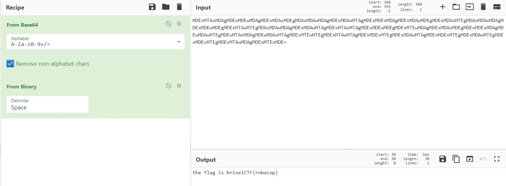

# s̸͖̾̀͊͠h̸̜̒ï̷̧̲͙̭̤͛͒̋t̷̢̲͚͖̑͜

Category: Cryptography

Points: 15

Description:

> A messenger droid was caught during the intergalactic war
>
> Upon investigating his memory banks, we found this message:
>
> MDExMTAxMDAgMDExMDEwMDAgMDExMDAxMDEgMDAxMDAwMDAgMDExMDAxMTAgMDExMDExMDAgMDExMDAwMDEgMDExMDAxMTEgMDAxMDAwMDAgMDExMDEwMDEgMDExMTAwMTEgMDAxMDAwMDAgMDExMDAwMTAgMDExMTAwMTAgMDExMDEwMDEgMDExMTEwMDAgMDExMDAxMDEgMDExMDExMDAgMDEwMDAwMTEgMDEwMTAxMDAgMDEwMDAxMTAgMDExMTEwMTEgMDExMTAwMTAgMDExMDExMTEgMDExMDAwMTAgMDExMDExMTEgMDExMDAwMTEgMDExMDExMTEgMDExMTAwMDAgMDExMTExMDE=
> 
> We are lucky we found him, he was only 64 parsecs from his base

## Solution

Just decrypt the base64, and after that decrypt the binary.

the flag is `brixelCTF{robocop}`