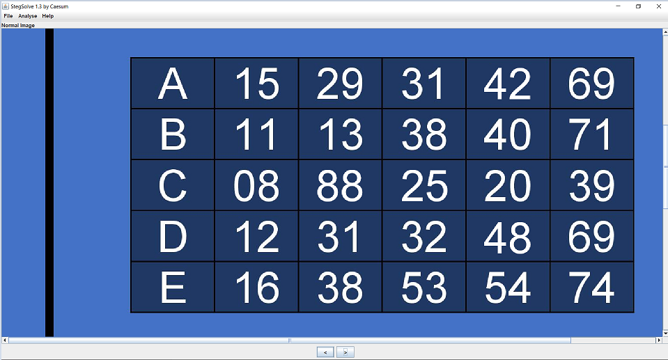
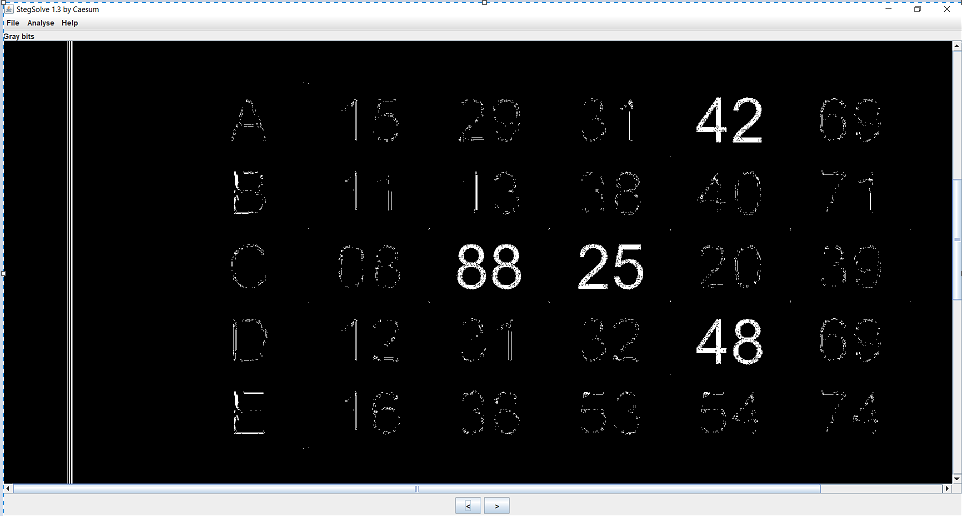

# Lottery ticket

Category: Forensics

Points: 10

Attached FIle: [lotteryticket.jpg](files/lotteryticket.jpg)

Description:

> Someone is trying to sell this lottery ticket online, it has the winning numbers but I suspect foul play

> Can you tell me which the new numbers are that are photoshopped?

> Add them all up, the resulting number is the flag

# Solution

The first step is you need to download the jpg file

As said in the challenge the image is photoshopped so I used a small java tool called Stegsolve

It applies some color filters or play with the color levels of the image.

Open the jpg file then click the left arrow key to change the color

You will see in the color Gray bits that the numbers 42,88,25,48 seems to be photoshopped

The challenge said that you need to add them up to get the flag

The flag is brixelCTF{203}
