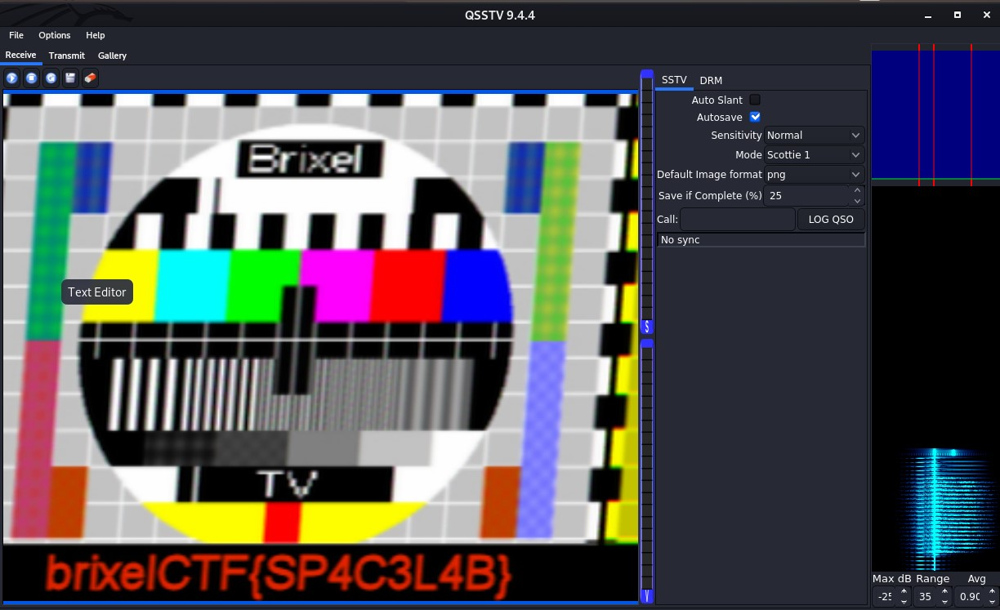

# A message from space

Category: Forensics

Points: 10

Attached File: [recording.wav](files/recording.wav)

Description:

> I received a message from space
>
> Beam me up scottie1!

## Solution

Looking onto the description, this gives us an idea that this challenge is SSTV-related.

So I used QSSTV tool on kali linux to examine the audio file.
- how to configure sstv? read instructions [here](https://ourcodeworld.com/articles/read/956/how-to-convert-decode-a-slow-scan-television-transmissions-sstv-audio-file-to-images-using-qsstv-in-ubuntu-18-04)

After waiting few seconds, the flag shows on the bottom side of the image.

the flag is `brixelCTF{SP4C3L4B}`