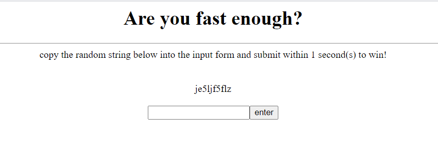

# Are You Fast Enough

Category: Programming

Points: 10

Description:

> Are you fast enough? copy the random string into the input form within 1 second to win!

## Solution



Copying the random string into the input form within 1 second manually is imposible so I planned to make a python script that automates the process. 

```
import mechanize
import bs4

key = ""
br = mechanize.Browser()
br.set_handle_equiv(False)
url = 'http://timesink.be/speedy/index.php'
html = br.open(url)  
soup = bs4.BeautifulSoup(html, "html.parser")
for i in soup.select('div[id$=rndstring]'):
	key = i.contents[0].strip()

br.select_form(nr = 0)     
br.form['inputfield'] = key
response = br.submit()
flag = bs4.BeautifulSoup(response, "html.parser")
print(flag)
```

In the script, python will parse the HTML from the website and  search the ID `rndstring` and get the value random string from it. After that, it will automatically clip it to the input form and submit it. Gotcha, we got the response flag from the PHP.


