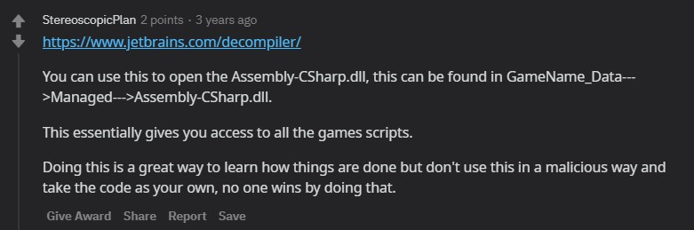
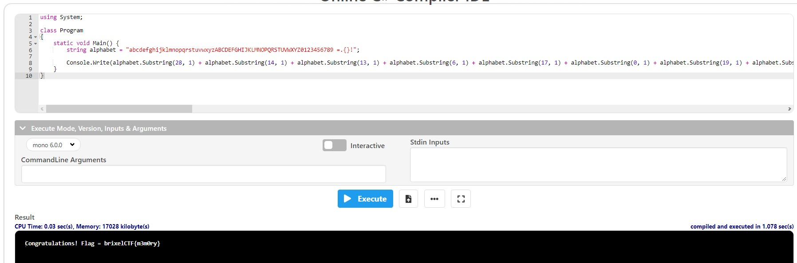

# Cookieee!

Category: Reverse Engineering / Cracking

Points: 15

Attached File: [cookieclicker_win.zip](files/cookieclicker_win.zip) [cookieclicker_linux.tar](files/cookieclicker_linux.tar)

Description:

> This stupid cookie clicker game...
>
> Legend has it there is a reward when you reach 10000000 or more clicks
>
> Can you think of a way to get that many clicks?

## Solution

Since I'm a Windows user, i'll download the `cookieclicker_win.zip` file.

Extracting the zip files gives me a **Cookie Clicker Game** made by Unity.


I have no idea on reversing a unity game so I search about it and I found this [comment](https://www.reddit.com/r/Unity3D/comments/6kc31q/is_there_a_way_to_reverse_engineer_a_unity_game/djm2nnt/) on a reddit post



Replicate the same steps, and while looking into it, I found this line of code in the `endGameScript` namespace that seems suspicious to me.


```
private string alphabet = "abcdefghijklmnopqrstuvwxyzABCDEFGHIJKLMNOPQRSTUVWXYZ0123456789 =.{}!";

private void Start() => GameObject.Find("endGame").GetComponent<Text>().text = this.alphabet.Substring(28, 1) + this.alphabet.Substring(14, 1) + this.alphabet.Substring(13, 1) + this.alphabet.Substring(6, 1) + this.alphabet.Substring(17, 1) + this.alphabet.Substring(0, 1) + this.alphabet.Substring(19, 1) + this.alphabet.Substring(20, 1) + this.alphabet.Substring(11, 1) + this.alphabet.Substring(0, 1) + this.alphabet.Substring(19, 1) + this.alphabet.Substring(8, 1) + this.alphabet.Substring(14, 1) + this.alphabet.Substring(13, 1) + this.alphabet.Substring(18, 1) + this.alphabet.Substring(67, 1) + this.alphabet.Substring(62, 1) + this.alphabet.Substring(31, 1) + this.alphabet.Substring(11, 1) + this.alphabet.Substring(0, 1) + this.alphabet.Substring(6, 1) + this.alphabet.Substring(62, 1) + this.alphabet.Substring(63, 1) + this.alphabet.Substring(62, 1) + this.alphabet.Substring(1, 1) + this.alphabet.Substring(17, 1) + this.alphabet.Substring(8, 1) + this.alphabet.Substring(23, 1) + this.alphabet.Substring(4, 1) + this.alphabet.Substring(11, 1) + this.alphabet.Substring(28, 1) + this.alphabet.Substring(45, 1) + this.alphabet.Substring(31, 1) + this.alphabet.Substring(65, 1) + this.alphabet.Substring(12, 1) + this.alphabet.Substring(55, 1) + this.alphabet.Substring(12, 1) + this.alphabet.Substring(52, 1) + this.alphabet.Substring(17, 1) + this.alphabet.Substring(24, 1) + this.alphabet.Substring(66, 1);
```

Running the code in an Online C# Compiler gives us the flag.



The flag is `brixelCTF{m3m0ry}`