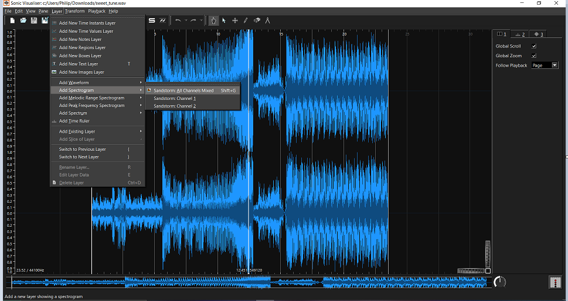
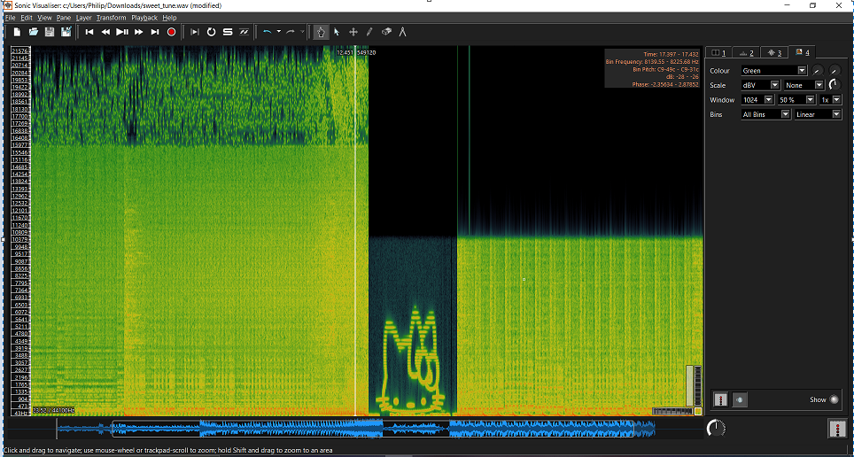

# Limewire audio

Category: Steganography

Points: 10

Attached File: [sweet_tune.wav](files/sweet_tune.wav)

Description:

> I downloaded this sweet tune from limewire, but there's something weird going on

> can you find the hidden message?

> The flag is the name of the character in english, no spaces!

# Solution

The first step is you need to download the WAV file

As said in the challenge there's a hidden message in the audio 

So I used a program that helps to analyse and visualize audio which is called Sonic Visualiser

Open the wav file then click the layer from the navigation bar and add spectrogram 

It reveals the english character hello kitty 

The challenge said that the flag has no spaces.

The flag is brixelCTF{hellokitty}
