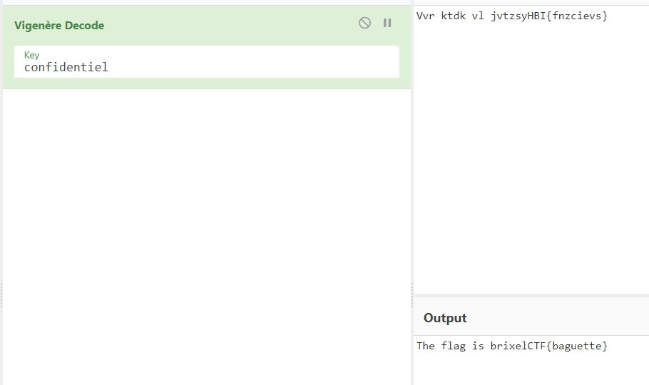

# Merde

Category: Steganography

Points: 5

Description:

> A french messenger was caught during the war
>
> He was carrying a piece of paper that read: Vvr ktdk vl jvtzsyHBI{fnzcievs}
>
> Upon torturing the messenger for an explaination, he only shouted 'confidentiel'!!!
>
> Too bad he died, I bet something good was in that message :(

## Solution

Reading the challenge description gives me an idea that it was related to a french cryptography **Vigenère cipher**.

Decoding the cipher with [CyberChef](https://gchq.github.io/CyberChef/#recipe=Vigenère_Decode('confidentiel')&input=VnZyIGt0ZGsgdmwganZ0enN5SEJJe2ZuemNpZXZzfQ) with a key "**confidentiel**" gives me the flag.

The flag is `brixelCTF{baguette}`