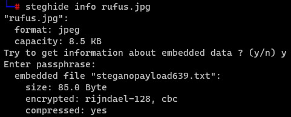
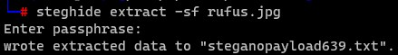

# Rufus the vampire cat

Category: Steganography

Points: 15

Attached File: [rufus.jpg](files/rufus.jpg)

Description:

> This is a picture of Rufus the vampire cat
>
> Despite being cute, Rufus hides a secret, up to you to find it
>
> This flag is not in the usual format, you can enter it with or without the brixelCTF{flag} format

## Solution

I used `steghide info` to check if there's something inside the *rufus.jpg* file
```
steghide info rufus.jpg
```


It looks like there is a *steganopayload639.txt* inside?

I extracted the text file with the following command, and inputted a blank passphrase.

```
steghide extract -sf rufus.jpg
```



Reading the text file will give us the flag!

> You thought this was a cute cat picture? NOPE! Chuck Testa! (the flag is:
chucktesta)

the flag is `brixelCTF{chucktesta}`