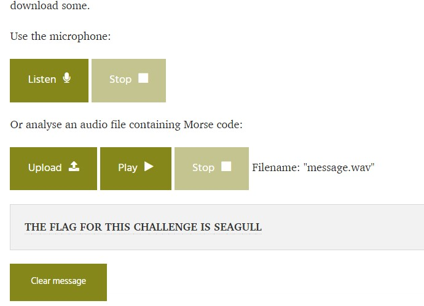

# Sea Code

Category: Steganography

Points: 5

Attached File:** [message.wav](files/message.wav)

Description:

> beep beep beeeep...
>
> This one should be fairly straight forward
>
> This flag is not in the usual format, you can enter it with or without the brixelCTF{flag} format

## Solution

Upon checking the given file, It contains an audio that sounds like a morse code. So I google a decoder and I found [this](https://morsecode.world/international/decoder/audio-decoder-expert.html).

Upload the wav file and hit that play button!

The flag is `brixelCTF{seagull}`